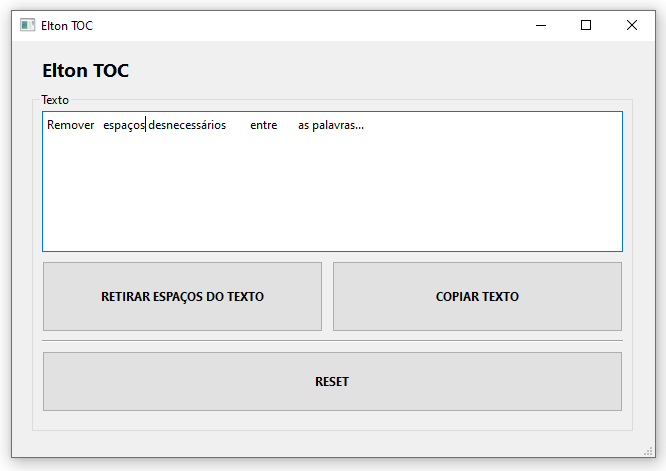

<h1 align="left">Elton TOC</h1>

<h2>Tecnologias</h2>
Esse projeto foi desenvolvido com as seguintes tecnologias:  
<ul>
    <li>Python</li>
    <li>PyQt6</li>
</ul>
<h2>Projeto</h2>

Programa desenvolvido com a finalidade de remover espaços em branco desnecessários entre palavras em um texto. Basta copiar e colar o bloco de texto no caixa de entrada do programa e apertar o botão para retirar os espaços...   Estudo Python: Desenvolvimento de um aplicativo para desktop, Criação de Pacotes e Interface Gráfica. Projeto pessoal que foi aproveitado em ambiente de trabalho.

O nome é mais uma brincadeira com colegas de trabalho: tinha um que ficava obcecado em remover os espaços em branco desnecessários dos textos que ele copiava a partir de planilhas ou documentos PDF...

